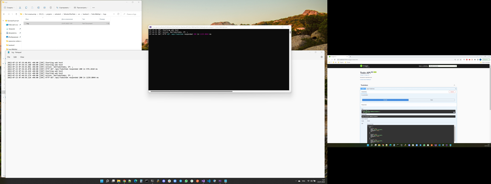

<h1 align="center">РК, Нур-Султан, 2022Q2</h1>

<h2 align="center">VelveTech</h2>

<h3 align="center">Todo Service Test Task</h3>

### Тестовое задание

    Добавить сваггер
    Хранить список задач в SQL Server (сейчас используется InMemoryDB). Строка соединения должна храниться в файле appsettings.
    Добавить логирование ошибок в файл
    Сделать рефакторинг - выделить слои Data Access Layer, Business Layer

### Реализация

    Для запуска приложения используется docker-compose.
    По умолчанию приложение стартует на порту 8080.
    Для работы приложения необходим файл .env, с примерно таким содержанием:
        DB_USER=sa
        DB_PASSWORD=Sql2019isfast
        DB_NAME_API=todo_test_db
    Примечание - Строки соединений для запуска приложения из docker и из VS различаются портами.

## API request screenshots

## Swagger screenshots

## Logger screenshots

### Контакты

    Танкибаев Абзал | Abzal Tankibayev
    Phone: +7-777-999-1873
    Email: Abzal.Tankibayev@outlook.com
    Telegram: https://t.me/Abzal_Tankibayev
