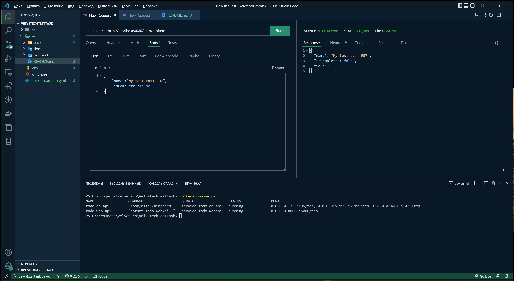
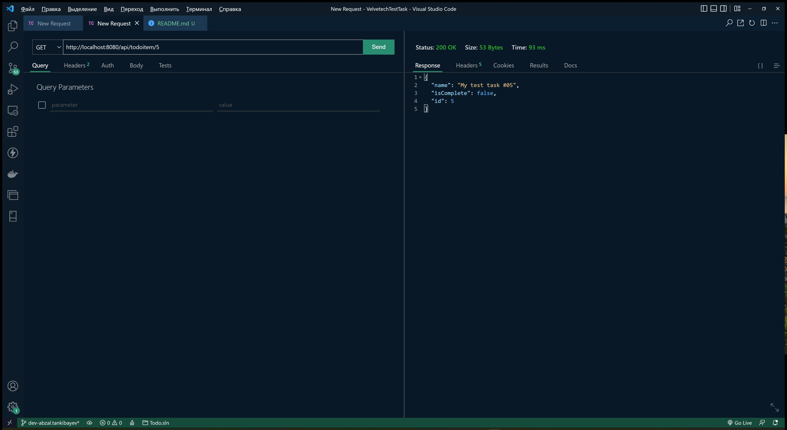

# Todo Service Test Task

### Тестовое задание

    Добавить сваггер
    Хранить список задач в SQL Server (сейчас используется InMemoryDB). Строка соединения должна храниться в файле appsettings.
    Добавить логирование ошибок в файл
    Сделать рефакторинг - выделить слои Data Access Layer, Business Layer

### Реализация

    Для запуска приложения используется docker-compose.
    По умолчанию приложение стартует на порту 8080.

## API request screenshots

## 2022-07 - РК, Нур-Султан

### Контакты

    Танкибаев Абзал | Abzal Tankibayev
    Phone: +7-777-999-1873
    Email: Abzal.Tankibayev@outlook.com
    Telegram: https://t.me/Abzal_Tankibayev
